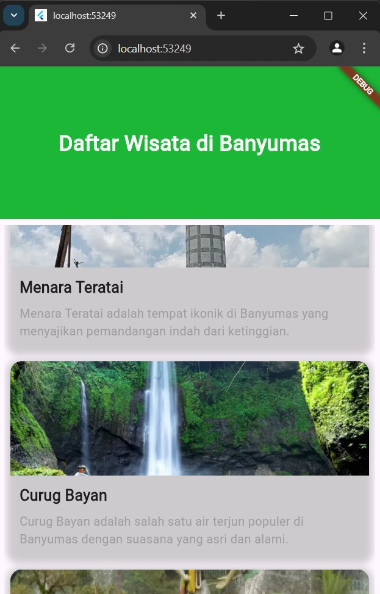

# Pertemuan 4
## GUIDED

1. Gridview
GridView.count(
  primary: false,
  padding: const EdgeInsets.all(20),
  crossAxisSpacing: 10,
  mainAxisSpacing: 10,
  crossAxisCount: 2,
  children: <Widget>[
    Container(
      padding: const EdgeInsets.all(8),
      child: const Text("He'd have you all unravel at the"),
      color: Colors.teal[100],
    ),
    Container(
      padding: const EdgeInsets.all(8),
      child: const Text('Heed not the rabble'),
      color: Colors.teal[200],
    ),
    Container(
      padding: const EdgeInsets.all(8),
      child: const Text('Sound of screams but the'),
      color: Colors.teal[300],
    ),
    Container(
      padding: const EdgeInsets.all(8),
      child: const Text('Who scream'),
      color: Colors.teal[400],
    ),
    Container(
      padding: const EdgeInsets.all(8),
      child: const Text('Revolution is coming...'),
      color: Colors.teal[500],
    ),
    Container(
      padding: const EdgeInsets.all(8),
      child: const Text('Revolution, they...'),
      color: Colors.teal[600],
    ),
  ],
);

2.List view
ListView(
  padding: const EdgeInsets.all(8),
  children: <Widget>[
    Container(
      height: 50,
      color: Colors.amber[600],
      child: const Center(child: Text('Entry A')),
    ),
    Container(
      height: 50,
      color: Colors.amber[500],
      child: const Center(child: Text('Entry B')),
    ),
    Container(
      height: 50,
      color: Colors.amber[100],
      child: const Center(child: Text('Entry C')),
    ),
  ],
);

Output

3. Stack
Stack(
    children: <Widget>[
        Container(
            width: 100,
            height: 100,
            color: Colors.red,
        ),
        Container(
            width: 90,
            height: 90,
            color: Colors.green,
        ),
        Container(
            width: 80,
            height: 80,
            color: Colors.blue,
        ),
    ],
)
Output:

UNGUIDED
Soal 1 :
Source code :
import 'package:flutter/material.dart';

void main() {
  runApp(const MainApp());
}

class MainApp extends StatelessWidget {
  const MainApp({super.key});

  @override
  Widget build(BuildContext context) {
    return MaterialApp(
      home: Scaffold(
        body: Column(
          children: [
            // Bagian Header tanpa melengkung
            Container(
              width: double.infinity,
              height: 200,
              decoration: const BoxDecoration(
                color: Color.fromARGB(255, 28, 183, 54),
              ),
              child: const Center(
                child: Text(
                  'Daftar Wisata di Banyumas',
                  style: TextStyle(
                    fontFamily: 'Roboto',
                    color: Colors.white,
                    fontSize: 28,
                    fontWeight: FontWeight.bold,
                  ),
                ),
              ),
            ),

            // Bagian konten daftar wisata dengan deskripsi
            Expanded(
              child: Padding(
                padding: const EdgeInsets.all(8.0),
                child: ListView.builder(
                  itemCount: wisataImages.length, // Panjang list image
                  itemBuilder: (context, index) {
                    return Container(
                      margin: const EdgeInsets.all(
                          8.0), // Tambah margin untuk jarak
                      decoration: BoxDecoration(
                        borderRadius: BorderRadius.circular(15),
                        boxShadow: [
                          BoxShadow(
                            color: Colors.grey.withOpacity(0.5),
                            spreadRadius: 5,
                            blurRadius: 7,
                            offset: const Offset(
                                0, 3), // Changes position of shadow
                          ),
                        ],
                      ),
                      child: Column(
                        crossAxisAlignment: CrossAxisAlignment.start,
                        children: [
                          // Gambar wisata
                          Container(
                            height: 150,
                            decoration: BoxDecoration(
                              borderRadius: const BorderRadius.only(
                                topLeft: Radius.circular(15),
                                topRight: Radius.circular(15),
                              ),
                              image: DecorationImage(
                                image: NetworkImage(wisataImages[
                                    index]), // Ambil gambar sesuai indeks
                                fit: BoxFit.cover,
                              ),
                            ),
                          ),
                          // Nama dan Deskripsi Wisata
                          Padding(
                            padding: const EdgeInsets.all(12.0),
                            child: Column(
                              crossAxisAlignment: CrossAxisAlignment.start,
                              children: [
                                Text(
                                  wisataTitles[
                                      index], // Tampilkan title sesuai indeks
                                  style: const TextStyle(
                                    fontSize: 20,
                                    fontWeight: FontWeight.bold,
                                  ),
                                ),
                                const SizedBox(
                                    height:
                                        8), // Jarak antara title dan deskripsi
                                Text(
                                  wisataDescriptions[
                                      index], // Tampilkan deskripsi sesuai indeks
                                  style: const TextStyle(
                                    fontSize: 16,
                                    color: Colors.grey,
                                  ),
                                ),
                              ],
                            ),
                          ),
                        ],
                      ),
                    );
                  },
                ),
              ),
            ),
          ],
        ),
      ),
    );
  }
}

// Daftar gambar wisata
final List<String> wisataImages = [
  'https://img.antaranews.com/cache/800x533/2022/05/03/menara-pandang.jpg.webp',
  'https://static.promediateknologi.id/crop/0x0:0x0/750x500/webp/photo/p1/803/2023/09/10/FotoJet-8-3700504590.jpg',
  'https://static.promediateknologi.id/crop/0x0:0x0/750x500/webp/photo/p1/09/2024/10/08/wisata-banyumas-2443733915.jpg',
];

// Daftar title wisata
final List<String> wisataTitles = [
  'Menara Teratai',
  'Curug Bayan',
  'Baturaden',
];

// Daftar deskripsi wisata
final List<String> wisataDescriptions = [
  'Menara Teratai adalah tempat ikonik di Banyumas yang menyajikan pemandangan indah dari ketinggian.',
  'Curug Bayan adalah salah satu air terjun populer di Banyumas dengan suasana yang asri dan alami.',
  'Baturaden adalah destinasi wisata pegunungan dengan udara sejuk dan pemandangan alam yang mempesona.',
];

output:

